.. _my-section:

DashCOMPASS
===========

`DashCOMPASS <http://compass.fmach.it/dashcompass>`_ is a basic Graphical User Interface for COMPASS to query the `VESPUCCI <https://vespucci.readthedocs.io>`_ database. It's meant primarily to showcase how to build tools on top of the
`pyCOMPASS <https://pycompass.readthedocs.io>`_ interface, but might be used to perform simple analysis to create a module that can be downloaded and further analyzed with third party programs.
These are the main operations that can be performed with DashCOMPASS.

Create a module starting from a set of gene locustag IDs
--------------------------------------------------------

The easiest and more straightforward way to create a new module is by the *Quick Search* panel. You need to provide gene locustag IDs in the text area and then click the *Search* button.
COMPASS will automatically search in the VESPUCCI database for the *best* conditions, i.e. conditions where the genes you selected show a high magnitude of expression changes (considering you selected the default *LIMMA* normalization)
and behave coherently. By default COMPASS limit the selection to the first 50 conditions, but this number can be changed by modifying the module.

.. _dc_1:
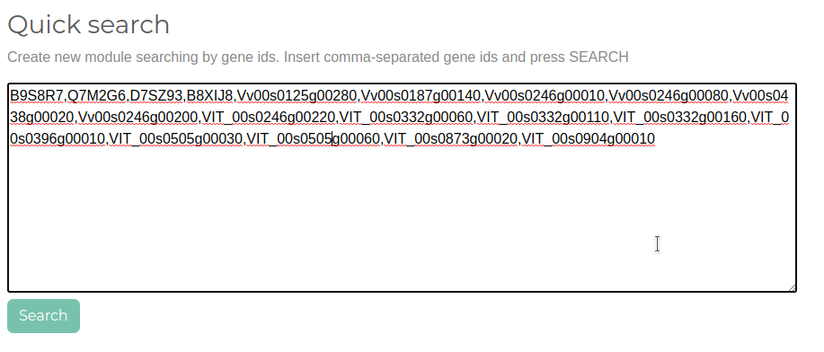

Create a module starting from a set of experiment IDs
-----------------------------------------------------

If you are interested in one or more specific experiment(s), you can use the *Search by experiment* tool in the *Advanced Search Options* panel. COMPASS will
automatically select the *best* genes, i.e. genes that show a high magnitude of expression changes (considering you selected the default *LIMMA* normalization)
and behave coherently across the conditions in the selected experiments.

.. _dc_2:
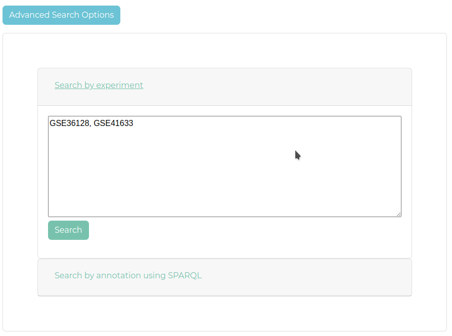

Create a module starting from gene annotation (via SPARQL)
----------------------------------------------------------

Using the *SPARQL* query language it is possible to select genes based on their annotation. Genes are annotated using Gene Ontology terms and EC number.

.. _dc_3:
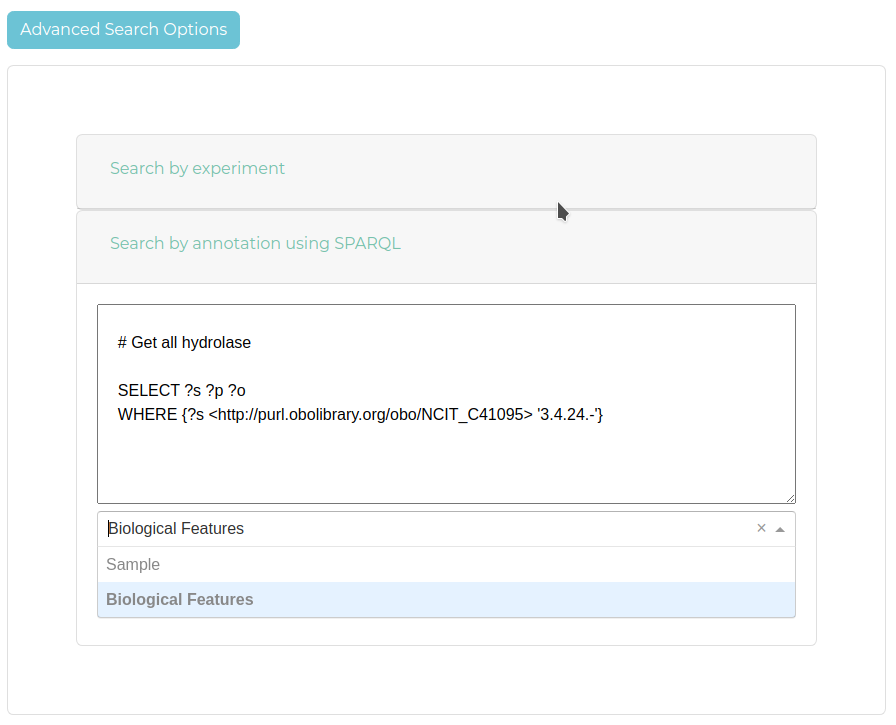

Create a module starting from sample annotation (via SPARQL)
------------------------------------------------------------

Using the *SPARQL* query language it is possible to select conditions based on sample's annotation. Several Ontology have been used for sample annotation
such as NCBI Taxon Ontology, Environment Ontology, Plant Experimental conditions Ontology, Agronomy Ontology, Phenotype and trait Ontology, Nci thesaurus, Plant Ontology, Bioassay Ontology, Experimental Factor Ontology and CHEBI.

.. _dc_4:
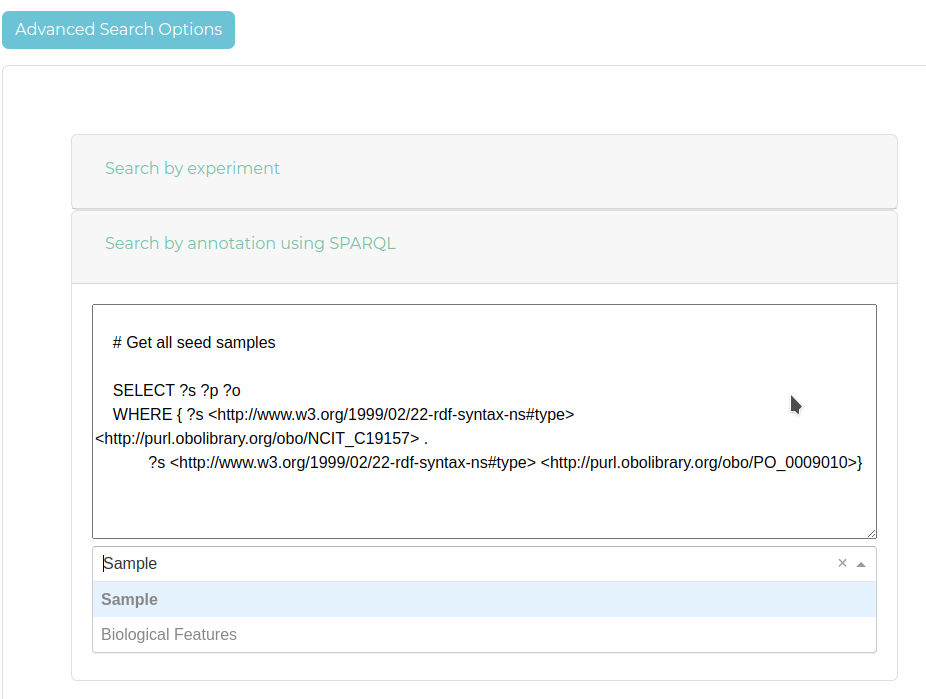

Visualize the expression heatmap with complete sample and gene annotation
-------------------------------------------------------------------------

Once a module has been created, the other tabs will be activated. The *Heatmap* tab will display the heatmap of the current module clustered in order to highlight the patterns of gene expression. By clicking on the heatmap it is possible
to visualise extra information related to the gene annotation, the condition annotation as well as the measurement value.

.. _dc_5:
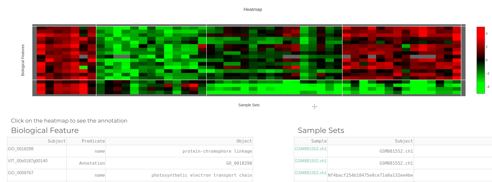

Visualize the gene co-expression network
----------------------------------------

The *Network* tab shows the gene co-expression network built from the current module. The PCC threshold can be selected using the *slider*. Positive correlation is depicted in purple, while negative correlation are yellow.

.. _dc_6:
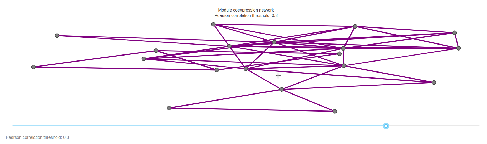

Get the full list of module's genes (biological features)
---------------------------------------------------------

The *Biological Feature* tab displays the complete annotation for module's genes.

.. _dc_7:
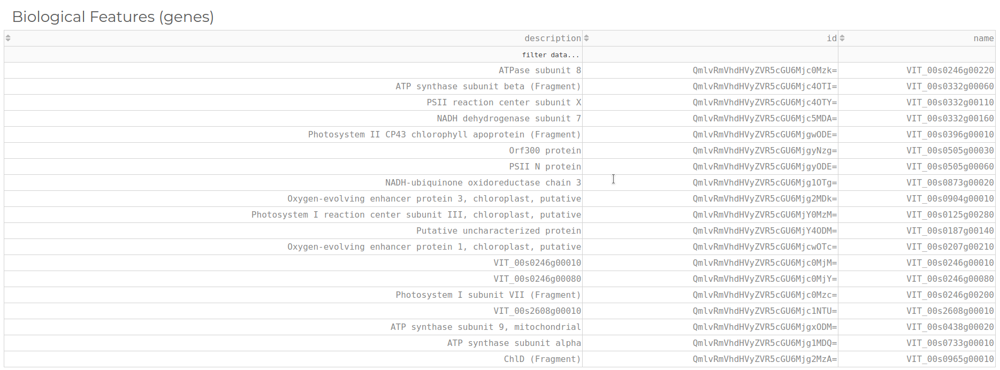

Get the full list of module's conditions (sample sets)
------------------------------------------------------

The *Sample Sets* tab displays the complete annotation for module's samples.

.. _dc_8:
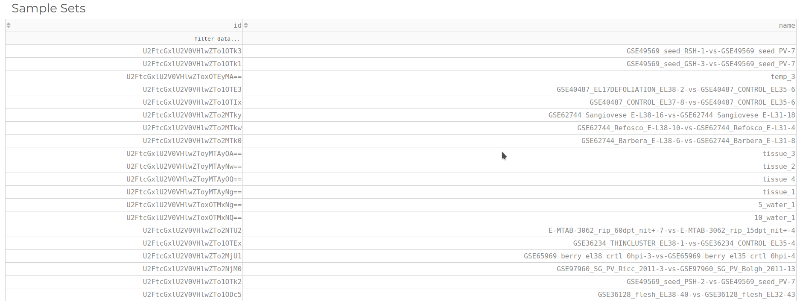

Download the module in TSV format
---------------------------------

From the *Tools* tab it is possible to download the current module in TSV format to be analyzed using third party software. The TSV file contains gene locustag ID as rows, condition and sample IDs as columns and the expression values.

.. _dc_9:
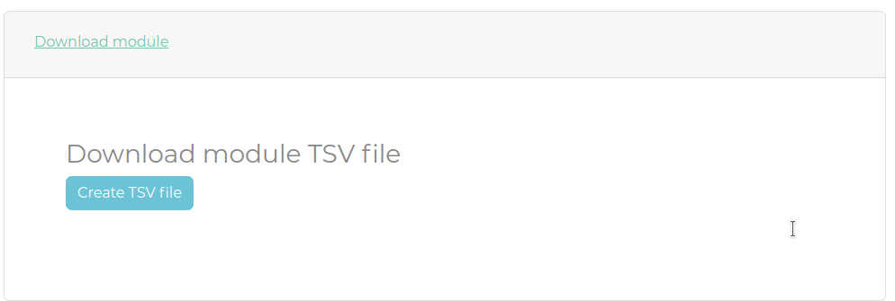

Modify the module by adding new genes
-------------------------------------

A module can be extended by adding more genes. The list of genes to add to the module can be manually defined by the user or can be suggested by COMPASS by looking at new genes that better correlate to module's ones based on current module's values.

.. _dc_10:
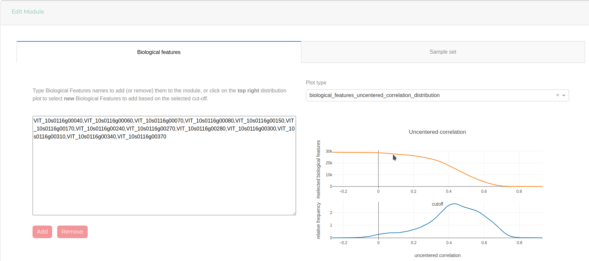

Modify the module by adding new conditions
------------------------------------------

A module can be extended by adding more conditions. The list of conditions to add to the module can be manually defined by the user or can be suggested by COMPASS by looking at new conditions that better correlate to module's ones based on current module's values.

.. _dc_11:
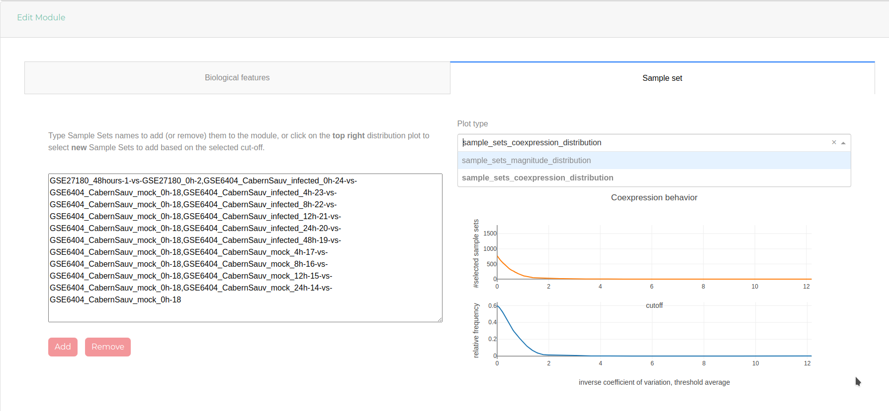