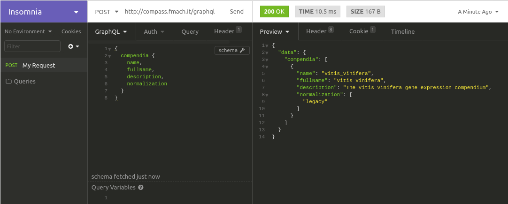

Quick start
===========

About GraphQL
-------------

*GraphQL is an open-source data query and manipulation language for APIs, and a runtime for fulfilling queries with existing data [...] It provides an efficient, powerful and flexible approach to developing web APIs, and has been compared and contrasted with REST and other web service architectures. It allows clients to define the structure of the data required, and exactly the same structure of the data is returned from the server* [#f1]_

Simple query using the Insomnia client
--------------------------------------

`Insomnia <https://insomnia.rest/>`_ is a powerful GraphQL client we are going to use in this documentation to show how to query a COMPASS GraphQL endpoint. First thing you'll need to know is the URL for the endpoint you want to query. Let's assume its a local installation we want to interrogate.

.. _query_1:

The result reflects the query structure and consists of a JSON document. Insomnia automatically queries the server for the GraphQL schema providing autocompletion of query terms easing the process of building a query when fields and parameters are unknown.

.. note::

   A simple Python script using the `requests <https://pypi.org/project/requests/>`_ package would work just fine, but maybe in that case you might want to have a look at the `pyCOMPASS <https://pycompass.readthedocs.io>`_ package.

   .. code-block:: python
      
      import requests

      url = 'http://compass.fmach.it/graphql'
      query = '''
        {
            compendia {
                name,
                fullName,
                description,
                normalization
            }
        }
      '''
      request = requests.post('http://compass.fmach.it/graphql', json={'query': query})
      print(request.json())

      

.. [#f1] Wikipedia `GraphQL <https://en.wikipedia.org/wiki/GraphQL>`_